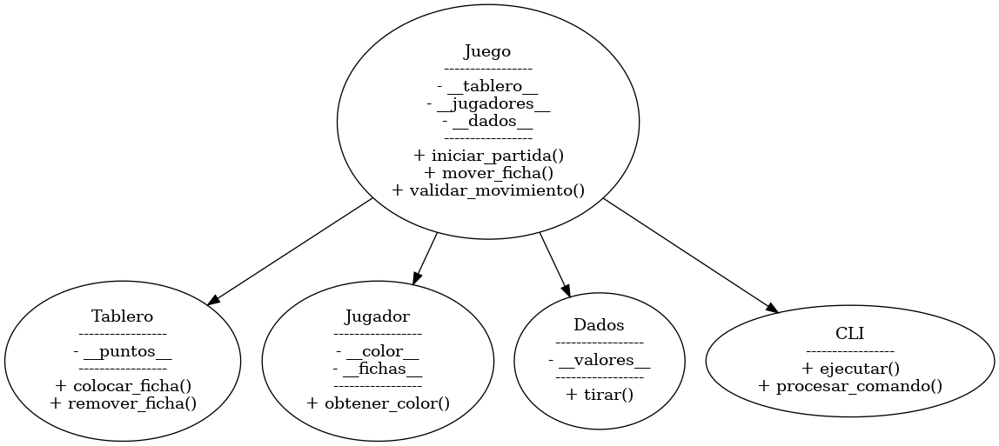

# JUSTIFICACION 

Este documento detalla las decisiones de diseño y las estrategias de desarrollo tomadas para la creacion del juego de Backgammon. El objetivo es justificar la estructura del proyecto y demostrar una comprension profunda de las elecciones realizadas.

## Resumen del Diseño General

El proyecto se penso con un enfoque en la **separación de la logica del negocio y la capa de presentacion**. Esto significa que el núcleo del juego, que maneja las reglas y la mecanica, es completamente independiente de como se muestra al usuario. Este enfoque modular permite implementar multiples interfaces de usuario (como la interfaz de linea de comandos y la grafica con Pygame) sin necesidad de modificar el codigo central.

El diseño del juego se basa en el paradigma de la Programación Orientada a Objetos (POO), con clases bien definidas que representan los componentes clave del Backgammon. Esto no solo facilita el desarrollo y el mantenimiento, sino que también nos permite adherirnos a principios como los SOLID.

## Justificación de las Clases Elegidas

Las siguientes clases se han definido para modelar el juego, con el objetivo de asignar una unica responsabilidad a cada una, de acuerdo con el **Principio de Responsabilidad Unica (SRP)**.

* `Juego`: Esta clase actua como el **coordinador principal** del juego. Su responsabilidad es gestionar el flujo de la partida, los turnos de los jugadores y las interacciones entre los diferentes componentes, como el tablero y los dados.
* `Tablero`: Representa el tablero fisico del Backgammon. Su función es gestionar los 24 puntos (triangulos), las fichas en cada punto, y las areas especiales como la barra central y el area de "home"(que seria cuando las fichas ya salen del tablero).
* `Jugador`: Modela a un jugador individual. Contiene información como el color de las fichas y la logica para gestionar los movimientos del jugador.
* `Dados`: Se encarga de la logica de los dados. Su unica responsabilidad es simular las tiradas, incluyendo la funcionalidad especial de las tiradas dobles.
* `Ficha`: Representa una sola ficha del juego. Tener una clase separada para las fichas permite gestionar de forma individual las propiedades de cada una, como su posición y color.
* `CLI` y `PygameUI`: Estas clases son las **capas de presentación** del juego. `CLI` se encarga de la interacción basada en texto en la consola, mientras que `PygameUI` maneja la interfaz gráfica. Su separación del `core` demuestra el cumplimiento del Principio de Responsabilidad Única.

## Justificación de Atributos y Decisiones de Diseño Relevantes

Todos los atributos de las clases siguen la convención de `__nombre__` para indicar que son parte interna de la clase y un atributo privado, de acuerdo con las buenas practicas establecidas en la consigna.

Ejemplos concretos:  
* `__tablero__` en `Juego`: centraliza el estado de la partida y facilita la validación de jugadas.  
* `__fichas__` en `Jugador`: permite llevar control preciso de cuántas fichas restan y dónde se ubican.  
* `__valores__` en `Dados`: guarda los resultados de la tirada para que se usen en una misma jugada.  
* `__color__` en `Jugador`: distingue inequívocamente a los jugadores y evita confusión en movimientos.  

**Decisiones clave**:  
* **Desarrollo incremental**: commits distribuidos que muestran evolución constante.  
* **Separación de capas**: el `core` nunca depende de la interfaz, lo que permite escalar fácilmente a nuevas formas de interacción.  
* **Diseño extensible**: al estar basado en clases desacopladas, se puede añadir una IA o nuevas variantes sin romper el diseño actual.  

## Excepciones y Manejo de Errores

Se diseñaron excepciones personalizadas que mejoran la claridad del código y evitan errores silenciosos. Algunas de ellas son:  

* `MovimientoInvalidoError`: cuando un jugador intenta hacer un movimiento que no respeta las reglas.  
* `SacarFichaError`: cuando se intenta retirar una ficha sin cumplir las condiciones necesarias.  
* `JugadorInvalidoError`: asegura que solo los jugadores válidos puedan interactuar con el sistema.  

Estas excepciones permiten controlar los flujos de error desde la interfaz (`CLI`) y brindar mensajes claros al usuario, mejorando la experiencia y evitando bloqueos inesperados.  

## Estrategias de Testing y Cobertura

Para garantizar la calidad y robustez del código, se ha adoptado una estrategia de testing rigurosa.  

* **Pruebas Unitarias (nivel core):** verifican casos como:  
  - movimientos válidos e inválidos,  
  - reingreso desde la barra,  
  - salida de fichas,  
  - condición de victoria.  

* **Pruebas de Integración (CLI):** comprueban que los mensajes mostrados y entradas de usuario se correspondan con el estado real del juego.  

* **Cobertura:** el objetivo es superar el **90% de cobertura** en la lógica central. Esto garantiza que se validen los escenarios principales y también los casos límite.  

*Ejemplo:* un test que comprueba que al sacar una ficha con un dado mayor al número de posiciones restantes se permita la jugada si todas las fichas están en el cuadrante final.  

## Referencias a Requisitos SOLID

El diseño del proyecto se alinea con los principios SOLID para garantizar un codigo limpio, extensible y fácil de mantener.

* **S (Single Responsibility Principle)**: Cada clase tiene una unica y clara responsabilidad, como se detallo en la seccion de justificacion de clases.
* **O (Open/Closed Principle)**: El codigo esta diseñado para ser extensible sin necesidad de modificar el codigo existente. 
* **L (Liskov Substitution Principle)**: Si se crearan subclases de `Jugador` (por ejemplo, `HumanPlayer` y `AIPlayer`), podrían ser usadas indistintamente por la clase `Juego` sin romper la funcionalidad.
* **I (Interface Segregation Principle)**: La interfaz CLI expone solo los métodos necesarios para interactuar con el usuario, sin sobrecargarlo de operaciones irrelevantes.  
* **D (Dependency Inversion Principle)**: La logica de alto nivel (`Juego`) no depende de las implementaciones concretas de la interfaz (`CLI`, `PygameUI`), sino de abstracciones. Esto se logra mediante la separación de las capas.

## Anexos

### Diagrama de Clases (simplificado)

## Conclusión

El diseño del proyecto cumple con los requisitos del proyecto, asegurando separación de responsabilidades, robustez mediante excepciones personalizadas y validación exhaustiva con tests. Además, se siguen los principios SOLID, lo que garantiza un código mantenible y extensible. La modularidad lograda permite futuras expansiones, como añadir una IA o la interfaz gráfica con Pygame, sin afectar la lógica central.  