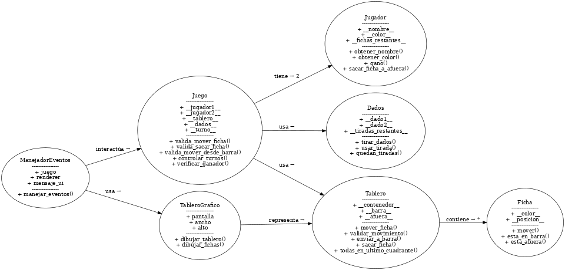

# Justificación del Diseño - Backgammon

## Resumen del Diseño General

El proyecto implementa el juego de Backgammon siguiendo una arquitectura modular que separa:

- **Lógica central** (core/): Maneja reglas y estado del juego
- **Interfaces de usuario**: 
  - CLI (cli/): Interfaz por consola
  - GUI (pygame_ui/): Interfaz gráfica con Pygame

Esta separación permite cambiar las interfaces sin modificar la lógica del juego.

## Justificación de las Clases

### Core

- **Juego**: Controlador principal que coordina jugadores, tablero y dados
  - Responsabilidad: Gestionar turnos y validar movimientos
  - Justificación: Necesario para centralizar la lógica del juego

- **Tablero**: Representa el estado físico del tablero
  - Responsabilidad: Mantener posición de fichas y validar movimientos básicos
  - Justificación: Encapsula la lógica específica del tablero

- **Jugador**: Representa a cada jugador
  - Responsabilidad: Mantener estado del jugador (color, fichas restantes)
  - Justificación: Encapsula atributos y comportamiento específico de jugadores

- **Dados**: Maneja la lógica de dados y tiradas
  - Responsabilidad: Generar valores aleatorios y gestionar tiradas disponibles
  - Justificación: Separa la lógica de dados del resto del juego

### Interfaces

- **TableroGrafico**: Renderiza el tablero en Pygame
  - Responsabilidad: Dibujar componentes visuales
  - Justificación: Separa la lógica de renderizado

- **ManejadorEventos**: Procesa entrada del usuario en Pygame
  - Responsabilidad: Traducir eventos a acciones del juego
  - Justificación: Desacopla la entrada de usuario de la lógica

## Justificación de Atributos

### Juego
- `__tablero__`: Instancia del tablero actual. Necesario para mantener y consultar el estado del juego
- `__jugador1__`: Referencia al primer jugador (Blancas)
- `__jugador2__`: Referencia al segundo jugador (Negras)
- `__jugadores__`: Lista con ambos jugadores para facilitar iteración y verificación de ganador
- `__dados__`: Instancia de dados para gestionar tiradas disponibles
- `__turno__`: Jugador actual, necesario para controlar el flujo del juego
- `__juego_terminado__`: Booleano que indica si alguien ganó, evita movimientos post-victoria

### Tablero
- `__contenedor__`: Lista de 24 posiciones que representa los puntos del tablero
- `__barra__`: Diccionario para fichas capturadas {"Blanca": [], "Negra": []}
- `__afuera__`: Diccionario para fichas sacadas {"Blanca": [], "Negra": []}

### Jugador
- `__nombre__`: String con el nombre del jugador para UI
- `__color__`: String ("Blanca"/"Negra") para identificar fichas
- `__fichas__`: Total de fichas iniciales (15)
- `__fichas_restantes__`: Contador de fichas aún no sacadas, necesario para determinar victoria

### Dados
- `__tiradas_restantes__`: Lista de números disponibles para mover
- `__rng__`: Generador de números aleatorios (para testing)

### TableroGrafico (Pygame)
- `pantalla`: Superficie de Pygame donde dibujar
- `ancho`, `alto`: Dimensiones del tablero
- `ancho_triangulo`, `ancho_barra`: Medidas para dibujar elementos
- `alto_triangulo`: Altura de los triángulos (puntos)
- `radio_ficha`: Radio de las fichas para dibujo y detección de clicks

### ManejadorEventos (Pygame)
- `juego`: Referencia al controlador principal
- `renderer`: Referencia al TableroGrafico
- `mensaje_ui`: Texto actual a mostrar en pantalla
- `tiempo_mensaje`: Duración del mensaje actual
- `punto_origen`: Punto seleccionado para mover (None si no hay selección)
- `running`: Control del bucle principal
- `ganador`: Referencia al jugador ganador si existe
- `tiempo_fin_juego`: Para controlar cierre de ventana post-victoria

## Decisiones de Diseño Relevantes

1. **Separación Core/UI**: 
   - La lógica del juego es independiente de la interfaz
   - Permite agregar nuevas interfaces sin modificar el core

2. **Estado Inmutable**: 
   - Los cambios de estado se validan antes de aplicarse
   - Evita estados inválidos

3. **Validación en Capas**:
   - Juego valida reglas de alto nivel
   - Tablero valida movimientos básicos
   - Mejor mantenibilidad y testing

## Excepciones y Manejo de Errores

Definidas en `core/excepcions.py`:

### MovimientoInvalidoError
- Lanzada cuando un movimiento viola reglas básicas:
  - Mover en dirección incorrecta
  - Mover a un punto bloqueado (2+ fichas enemigas)
  - Mover una ficha que no pertenece al jugador
  - Mover sin dados disponibles
  - Mover desde/hacia posiciones fuera del tablero
  - Nombres de jugadores inválidos o duplicados

### SacarFichaError
- Lanzada al intentar sacar fichas ilegalmente:
  - Sacar cuando hay fichas fuera del último cuadrante
  - Sacar usando un dado mayor cuando hay fichas más lejanas
  - Sacar desde un punto sin fichas propias
  - Fallo interno del tablero al sacar

### EntradaInvalidaError
- Lanzada por errores de input del usuario:
  - Coordenadas fuera de rango (1-24)
  - Entrada no numérica cuando se espera un número
  - Selección de opción inválida en menús

### RendicionError
- Lanzada cuando un jugador elige rendirse
- Permite terminar el juego prematuramente

### JuegoTerminadoError
- Lanzada cuando se solicita terminar el juego
- Diferente de RendicionError para distinguir fin normal vs rendición

## Estrategias de Testing

### Cobertura

- Tests unitarios para cada clase del core
- Tests de integración para interacciones entre clases
- Tests específicos para casos borde y situaciones especiales

### Áreas Principales Testeadas

1. **Movimientos**:
   - Movimientos válidos/inválidos
   - Capturas
   - Reingreso desde barra
   - Sacar fichas

2. **Dados**:
   - Generación de valores
   - Consumo de tiradas
   - Manejo de dobles

3. **Estado del Juego**:
   - Cambios de turno
   - Detección de ganador
   - Validaciones de entrada

## Principios SOLID

1. **Single Responsibility (SRP)**:
   - Cada clase tiene una única responsabilidad
   - Ej: Tablero solo maneja estado, Dados solo manejan tiradas

2. **Open/Closed (OCP)**:
   - Extensible sin modificar código existente
   - Ej: Nuevas interfaces de usuario

3. **Liskov Substitution (LSP)**:
   - Las interfaces son consistentes
   - Ej: Cualquier UI puede usar el core sin modificarlo

4. **Interface Segregation (ISP)**:
   - Interfaces pequeñas y específicas
   - Ej: Separación entre lógica de juego y renderizado

5. **Dependency Inversion (DIP)**:
   - Core no depende de implementaciones específicas
   - Ej: Juego acepta cualquier implementación de Tablero/Dados

## Anexo: Diagrama de Clases
 esta en assert

## Conclusión

El diseño del proyecto cumple con los requisitos del proyecto, asegurando separación de responsabilidades, robustez mediante excepciones personalizadas y validación exhaustiva con tests. Además, se siguen los principios SOLID, lo que garantiza un código mantenible y extensible. La modularidad lograda permite futuras expansiones, como añadir una IA o la interfaz gráfica con Pygame, sin afectar la lógica central. 